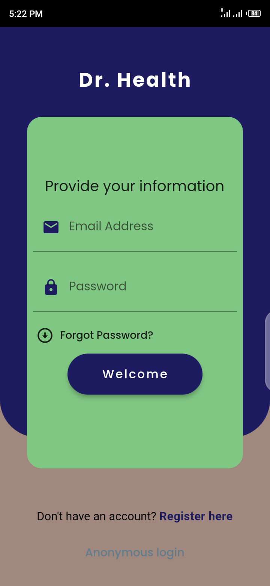
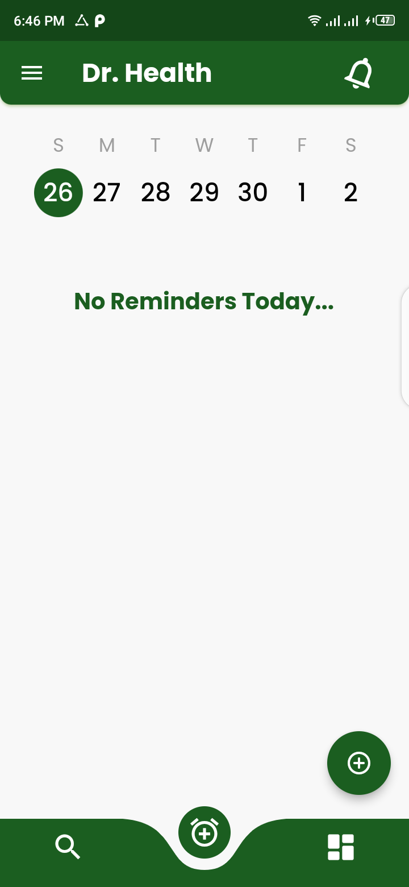
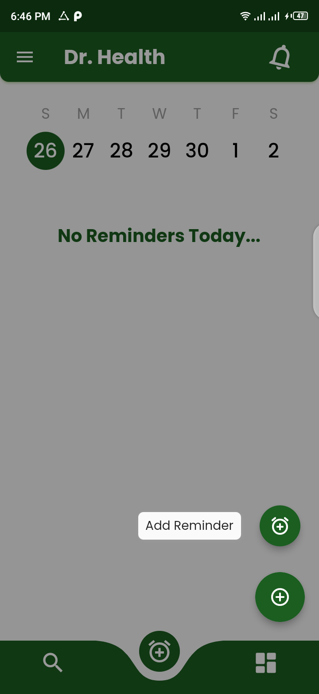
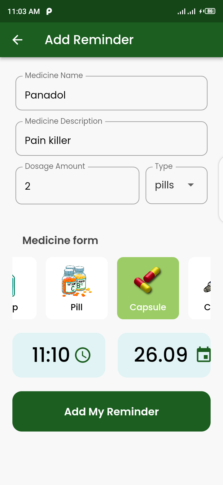
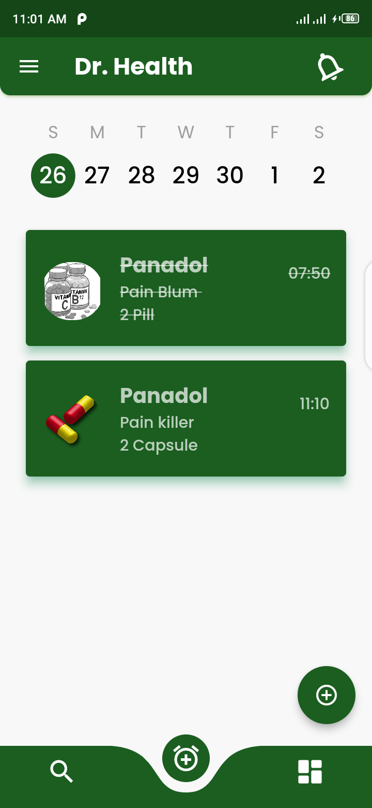
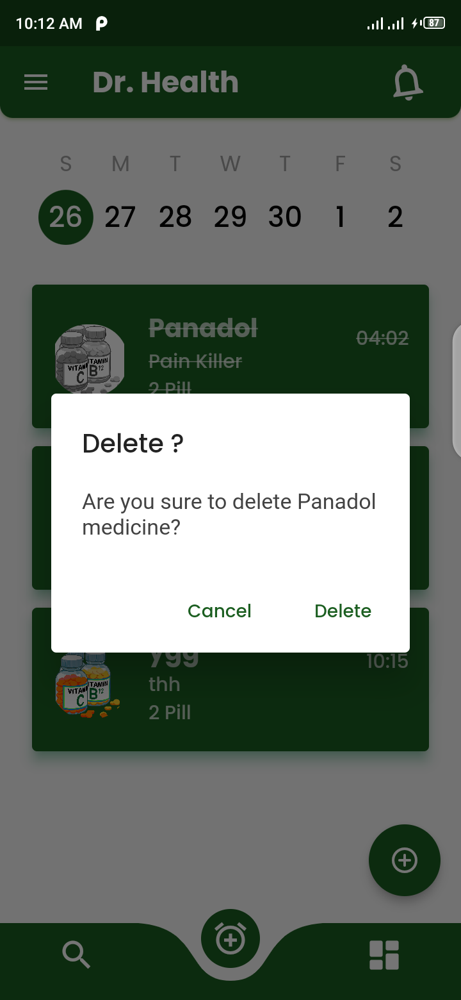
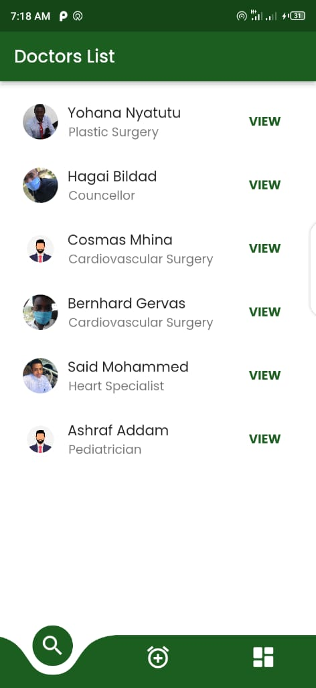
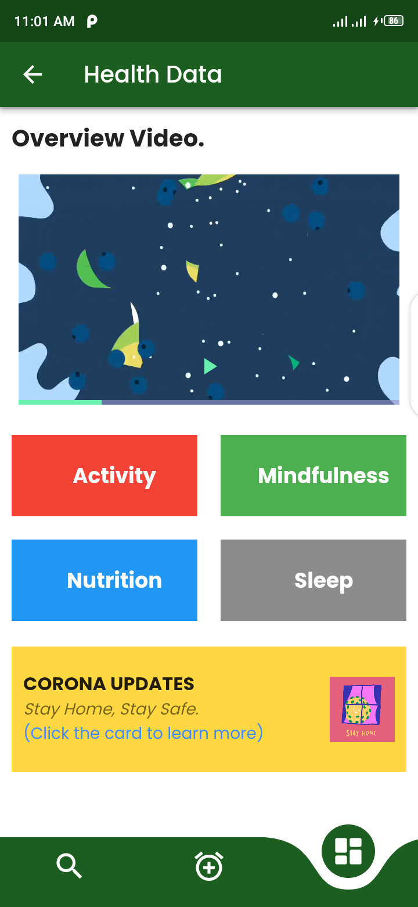
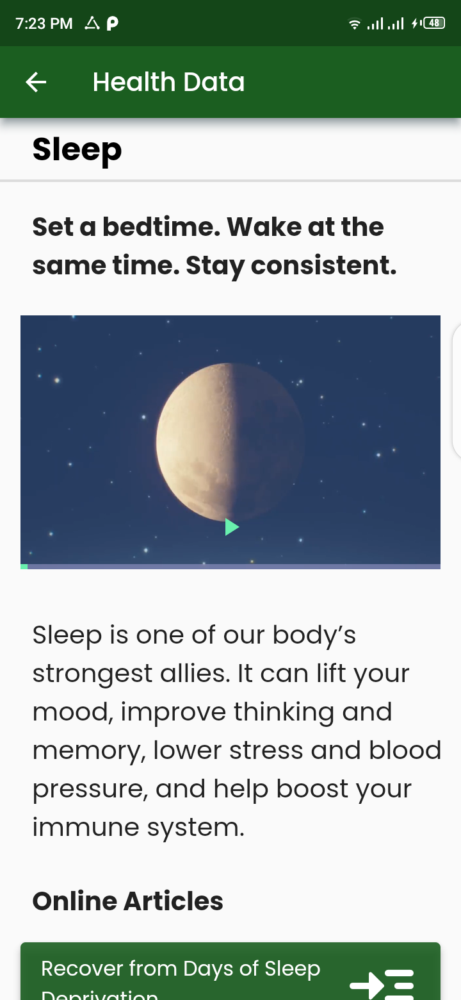
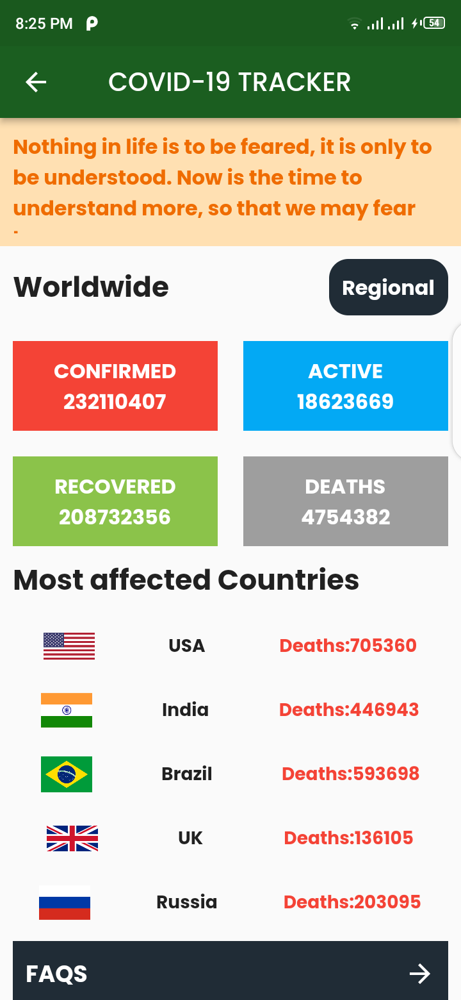

# dr_health

A Medication Reminder Application.

flutter --version
Flutter 2.2.3 • channel stable • https://github.com/flutter/flutter.git
Framework • revision f4abaa0735 (9 weeks ago) • 2021-07-01 12:46:11 -0700
Engine • revision 241c87ad80
Tools • Dart 2.13.4

dart --version
Dart SDK version: 2.13.4 (stable) (Wed Jun 23 13:08:41 2021 +0200) on "windows_x64"

#### A Flutter application, which you can save medicines and app will be send remind when you have to take it :bell:

A few resources to get you started if this is your first Flutter project:

- [Lab: Write your first Flutter app](https://flutter.dev/docs/get-started/codelab)
- [Cookbook: Useful Flutter samples](https://flutter.dev/docs/cookbook)

For help getting started with Flutter, view our
[online documentation](https://flutter.dev/docs), which offers tutorials,
samples, guidance on mobile development, and a full API reference.

### App features :
- [x] Save medicines in local database
- [x] Show notification in correct time
- [x] Delete medicines
- [x] View Doctor Details
- [x] View Covid-19 updates

### snapshots :

